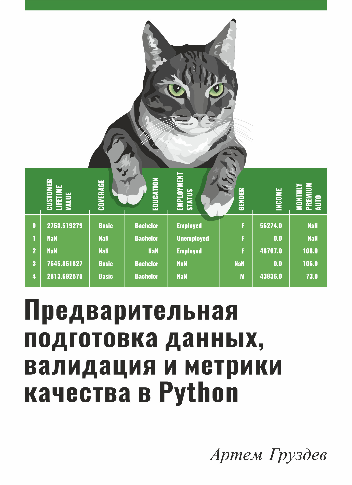

# Предварительная подготовка данных в Python

Этот репозиторий содержит программный код к книге "Предварительная подготовка данных в Python" [Артема Груздева](https://t.me/Gewissta).
Книга является коллекцией избранных материалов из первого модуля [Подписки](https://boosty.to/gewissta) – обновляемых в режиме реального времени материалов по применению классических методов машинного обучения в различных промышленных задачах, которые автор делает вместе с коллегами и учениками.
Детальную информацию о книге вы можете найти на веб-сайте издательства "ДМК-Пресс" [том 1](https://dmkpress.com/catalog/computer/programming/python/978-5-93700-156-6/) и [том 2](https://dmkpress.com/catalog/computer/programming/python/978-5-93700-177-1/).

Книга требует последние версии scikit-learn, pandas, NumPy, SciPy.

Для любопытных на обложке книги - стилизованное изображение любимицы автора, кошки Матильды, прожившей 22 года. Собственно ей книга и посвящена.

Данный репозиторий не содержит файлы данных размером свыше 100 мегабайт, полный каталог со всеми файлами данных и программным кодом вы найдете на сайте издательства.

## Опечатки
Всю информацию по опечаткам отправляйте на [электронную почту](mailto:info@gewissta.ru).

## Обновления программного кода

В отличие от программного кода каталога, выложенного издательством, программный код данного репозитория может обновляться (исправления).

## Список найденных опечаток:

## Список исправлений программного кода:

